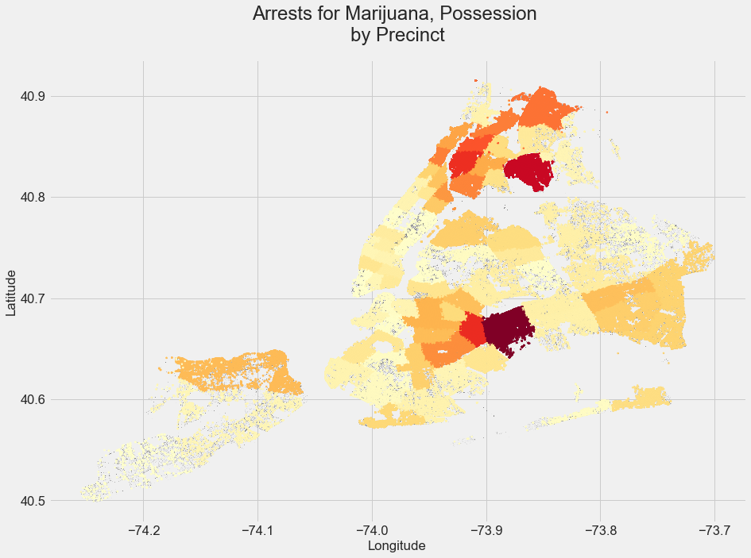
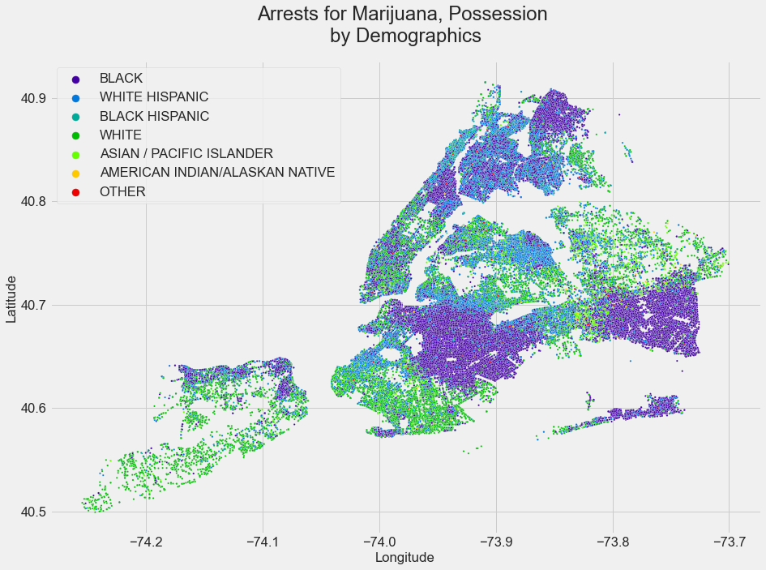
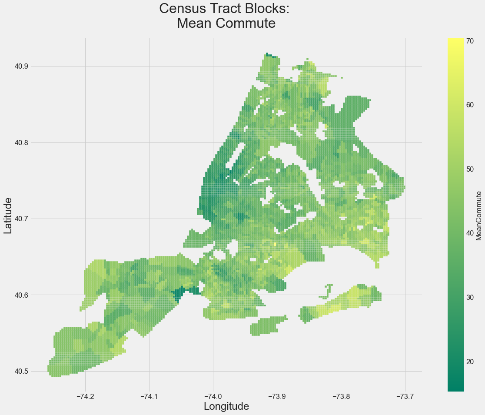
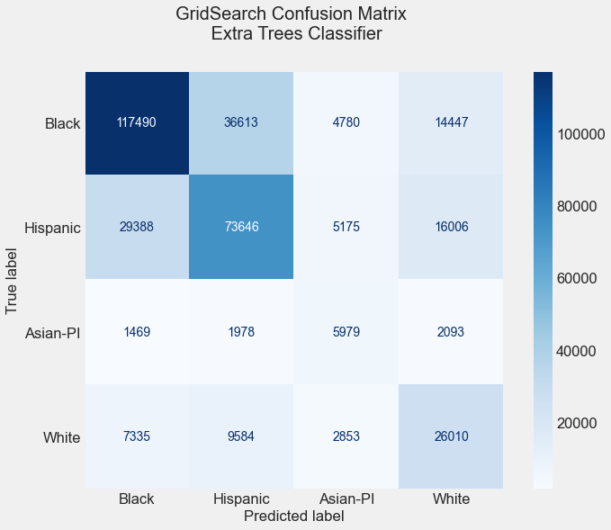
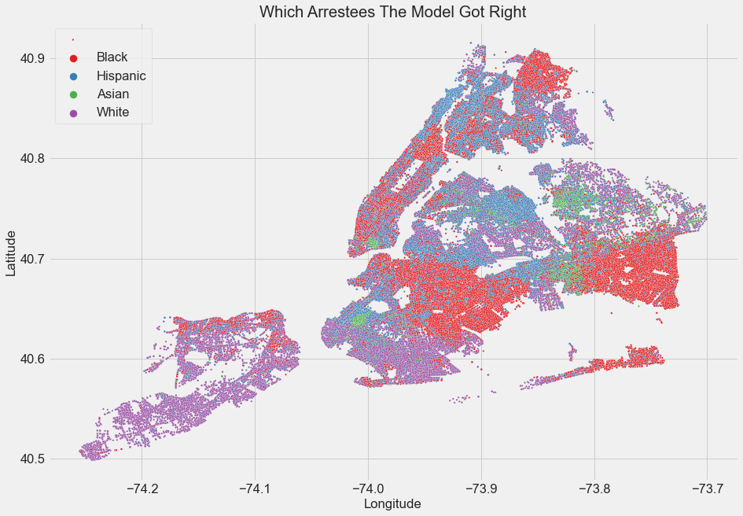
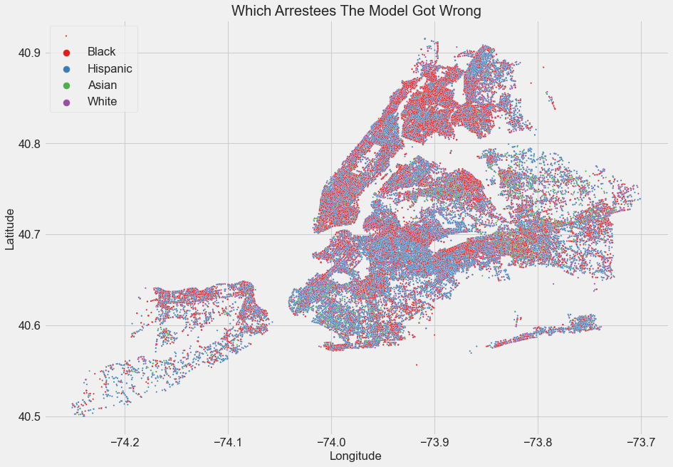

# NYPD Arrest Records 2006-2019
- [ ] - - -

# A Project by
	Yasmine Hays
	Ryland Mathews

## Table of Contents
> 1) Data Cleaning   
> 2) NYPD Arrests Exploratory Data Analysis  
> 3) Census Data Visualization  
> 4) NYPD Complaints EDA  
> 5) Supervised Learning Model   

##  Problem Statement
The NYPD has a history of racially disparate outcomes in their arrest record, but is it so severe as to be exceptionally predictable?
## Background
The history of racial disparity in NYPD policing tactics has long been documented and inferred up especially with their adaptation of a number of key policies which have arguably made their arrests even more racially biased. In 1995 the NYPD was the first to adapt Compstat which is an internal data driven policing system that in theory suggests who and where police should target in order to reduce crime. Compstat has long been criticized for leading to over policing of people of color. In addition to this, the NYPD also widely practices what are called “Stop and Frisk” procedures. These procedures are not heavily regulated and allow any officer to use their own discretion to stop and search anyone whom they think suspicious. This policy has also lead to the over-policing and even harassment of people of color by the NYPD. Another policing tactic employed by the NYPD that has caused disproportionality high arrests among people of color is what is called “Broken Windows Policing”. This theory was adapted by the NYPD in the 1990s and operates on the theory that high scale crime is reduced by reducing low scale crime. That is to say that if the police target smaller crimes and the people committing them then they will also reduce larger crimes. This theory and tactic has also lead to over-policing in areas where the residents are mostly people of color and can be seen as a direct contributor to the racial disparity seen in the arrests made by the NYPD.

## The Dataset
To recreate this process, please download the datasets linked below:
> [NYC Census Data](https://www.kaggle.com/muonneutrino/new-york-city-census-data?select=census_block_loc.csv)  
> [NYPD Arrests Records](https://www.kaggle.com/thaddeussegura/nypd-arrest-data-20062019)   
> [NYPD Complaints Records](http://www.propublica.org/datastore/dataset/civilian-complaints-against-new-york-city-police-officers)  
## Libraries Used
> pandas  
> numpy  
> seaborn  
> matplotlib  
> datetime  
> time  
> tqdm  
> haversine  
> sklearn   

## Arrest Records Exploratory Data Analysis
Black arrestees are overrepresented among the arrest records for a city with a black population of approximately 28.9%. White New Yorkers make up almost 32.5% of the city's population but are less than half of that in the arrest record, and Asian-Pacific Islander make up 14% of the city's general population but make up only 4% of the arrest record

Since the Census only has a single Hispanic category, the White Hispanic and Black Hispanic NYPD categories were consolidated in data cleaning for our modeling purposes, but left as they are in this notebook

Seen below, marijuana arrests for both sale and possession are much more localized to certain precincts, and shows that marijuana arrests for Black people in particular outpace the already disproportionate number of Black people arrested by the NYPD. This data would also be useful for those pushing for the commuting of sentences for those who were charged following these arrests, as NYC has recently legalized marijuana. Sale and possession are counted as different offenses in our data cleaning process




One of the most interesting findings, the NYPD has classifications for ‘Mischief, Criminal’ as well as ‘Criminal Mischief’, and there seems to be some racial disparity between the two, as Criminal Mischief sees white arrestees represented at almost double their rate over all arrestees, and Criminal Mischief seems uniquely overrepresented on the southern tip of Manhattan
```
Description Count:
CRIMINAL MISCHIEF 4TH, GRAFFITI     17906
CRIMINAL MISCHIEF,UNCLASSIFIED 4     4237
CRIMINAL MISCHIEF 4TH, GRAFFIT        934
Name: PD_DESC, dtype: int64
```
```
Arrestee Demographics:
WHITE HISPANIC                    0.345
WHITE                             0.287
BLACK                             0.240
BLACK HISPANIC                    0.080
ASIAN / PACIFIC ISLANDER          0.038
AMERICAN INDIAN/ALASKAN NATIVE    0.002
```

## Census Data Visualization
The Census Data Visualization notebook shows the economic and demographic trends across the city, which can be conveniently plotted as the Census Tracts are divided along an interval grid of Latitude and Longitude Coordinates, for example, Mean Commute Time:



## Complaints Exploratory Data Analysis
* The dataset contains 33,358 rows of data spanning 36 years from 1985 to 2020
* Nearly 60% of civilian complaints against NYPD officers were filed by Black People , 22% by Hispanic People and 10% from White people.
* Median age of complainants were slightly younger for Black and Hispanic groups than for White, Asian and American Indian people.
* The range in the number of complaints filed against any single precinct is from 400 - 2172.
* There are four different types of complaint. “Abuse of Authority” is by far the most reported complaint against police and has more than double the amount of any other group. The other groups are “Force”, “Discourtesy” and “Offensive Language”.
* The proportion of the type of complaint for each of the three pecincts with the highest number of complaints all follow the same pattern. Abuse of authority is reported the most, followed by Force, then Discourtesy and finally Offensive Language
* The top allegations against NYPD police officers are of a physical nature for Black People and Hispanic People, but of a verbal nature for white people and Asian people. Allegations made by American Indians mostly pertained to being searched.
* For each ethnicity the outcome of the complaint most often did not result in arrest. The complaints that did result in arrest broke down as follows: 46.7% of Hispanics who complained were arrested, 45.8% of Black People who complained were arrested, 34.7% of White people who complained were arrested, 12.5% of Asian people who complained were arrested and 12.5% of American Indian people who complained were arrested.

## Supervised Learning Model
Because we’re looking at arrests of Black and Hispanic people in NYC that are already disproportionally represented compared to the general population, most of our analysis of our model results are taken from a run of the model without oversampling; we were less concerned with misclassifications of white and Asian/Pacific Islander arrestees as they’re already underrepresented in the arrest record compared to the general population. Results from running the model with random oversampling can be found below the Conclusions section



The main misclassification was between Black and Hispanic arrestees, and while oversampling slightly improves the performance of the model with misclassifying white and Asian arrestees, it exacerbates the much more frequent conflation between Black and Hispanic




Since each class of of offense was encoded, we could see just how well the model performed for each alleged nonviolent offense
```
[pending]
```
## Conclusion
That the limits on the ability to predict the race of an arrestee mostly falls to conflation between nonviolent Black and Hispanic arrestees illustrates a system that clearly practices greater restraint when it comes to the policing of white people while throwing the book at people of color.
Complaints against the NYPD show the same results as the arrests. Black and Hispanic people file complaints against the NYPD much more than white, indigenous or asian people and the complaints filed by people of color are generally based on physical force as opposed to verbal assault.

## Next Steps
* Vectorize/multithread the Haversine process for finding nearest Census Tract
* More detailed analysis of which precincts have the most disparate outcomes
* Use an unsupervised learning model to determine which precincts have the most disparate outcomes for their locality
* More granular arrest offense classifications
* Use a neural-network model
